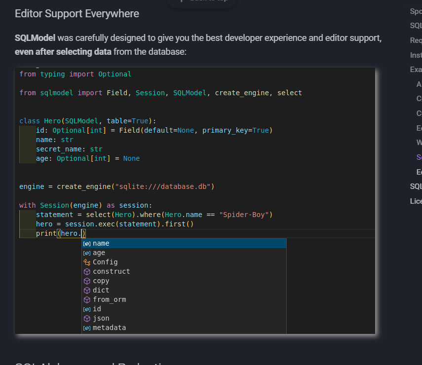

[Criação de tabela](https://docs.sqlalchemy.org/en/20/orm/quickstart.html)

[Relações](https://docs.sqlalchemy.org/en/13/orm/basic_relationships.html#one-to-one)

[Tipos de dados](https://docs.sqlalchemy.org/en/20/core/types.html)

https://sqlmodel.tiangolo.com/#select-from-the-database